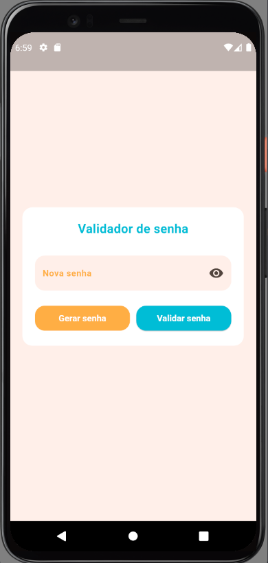
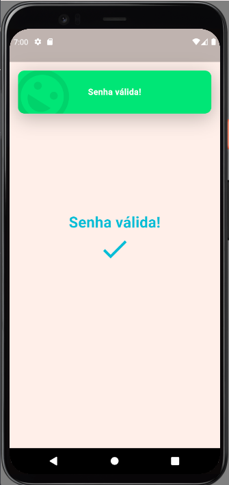

# Deafio técnico - Model View Labs

Este projeto trata-se de um validador de senha.

É um app com duas telas, onde, na primeira, o usuário pode digitar uma senha ou solicitar uma gerada automaticamente pelo servidor.

Essa senha será validada, e, se estiver dentro dos padrões de segurança da empresa, o usuário será encaminhado para uma nova tela.

## Instalação do projeto

Disponibilizando o APK em relesa para testes

<h6> Download APK - Link direto Google Drive </h6>

<div style="display: flex; align-items: center; ">
    <a href="https://drive.google.com/uc?export=download&id=1-Q-6gzGVUvzzK0VCcyQUr8OejUw_4NUp" target="_blank">
        
    </a>
    
</div>
<br>

## Aplicativo

Conforme sugerido pelo enunciado, o aplicativo conta com duas telas, sendo que a primeira contém as funcionalidades e realiza as consultas à API.

<ol>
    <li>Tela principal</li>
    <ul>
        <li>O usuário pode digitar a própria senha</li>
        <li>O usuário pode optar por uma senha gerada pelo servidor</li>
        <li>Ao ser gerada uma senha, ela é exibida e é dada a opção do usuário copiar a senha para salvá-la</li>
    </ul>
    <li>Tela de sucesso</li>
    <ul>
        <li>Exibe para o usuário que a sua senha é válida</li>
    </ul>
</ol>

<div style="display: flex; align-items: center; ">
     
    <div style="margin-left: 25px;" ></div>  
       
</div>
<br>

## Build da aplicação

Projeto desenvolvido em Flutter na versão **3.24.3** e Dart na versão **3.5.3**

Por motivos de segurança e privacidade a URL da API precisa ser configurada pelo arquivo **env.json**

>*Não subir este arquivo para o repositório.*

### Configurando **env.json**
   
   A nivel de projeto, crie uma pasta "**./config**" e dentro da mesma crie um arquivo "**env.json**".

   Para configurar a URL da Api copie a estrutura a abaixo e cole neste arquivo

   ```json
{
    "BASE_URL": "https://link_da_api.com"
}
   ```

   Após feito esse processo, não se esqueça de adicionar sempre no comando de build para ler este arquivo

```shell
flutter build apk --release --dart-define-from-file ./config/env.json
```
<hr>
<br>
<br>

Para facilitar o debug e desenvolvimento do APP recomendo adicionar estes argumentos adicionais ao seu arquivo **launch.json** do VS Code.

```json
{
    "version": "0.2.0",
    "configurations": [
        {
            "name": "launch_name_dev",
            "request": "launch",
            "type": "dart",
            // Adicionar argumentos
            "args": [
                "--dart-define-from-file",
                "./config/env.json"
            ]
        },
        ...
    ]
}
```

<br>

## Projeto

### Informações adicionais sobre o projeto

**Injeção de dependência:** GetIt <br>
**Gerenciador de estado:** Signals <br>
**Requisições HTTP**: Dio