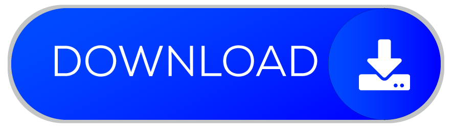

# Deafio técnico - Model View Labs

Este projeto trata-se de um validador de senha.

É um app com duas telas, onde, na primeira, o usuário pode digitar uma senha ou solicitar uma gerada automaticamente pelo servidor.

Essa senha será validada, e, se estiver dentro dos padrões de segurança da empresa, o usuário será encaminhado para uma nova tela.

## Instalação do projeto

Disponibilizando o APK em relesa para testes

    
    | Download APK - Link direto Google Drive

## Aplicativo

Conforme sugerido pelo enunciado o aplicativo conta com duas telas

       
       

This project is a starting point for a Flutter application.

A few resources to get you started if this is your first Flutter project:

- [Lab: Write your first Flutter app](https://docs.flutter.dev/get-started/codelab)
- [Cookbook: Useful Flutter samples](https://docs.flutter.dev/cookbook)

For help getting started with Flutter development, view the
[online documentation](https://docs.flutter.dev/), which offers tutorials,
samples, guidance on mobile development, and a full API reference.

https://drive.google.com/uc?export=download&id=1-Q-6gzGVUvzzK0VCcyQUr8OejUw_4NUp
